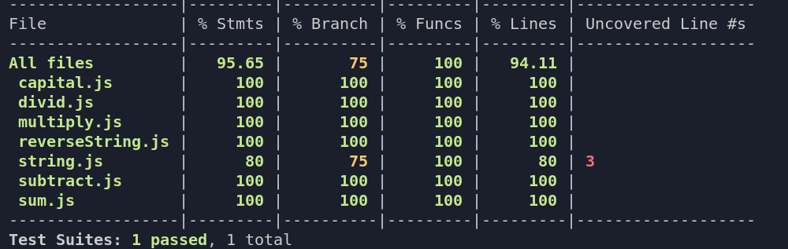

# JavaScript Testing

> Using jest to test if the functions added are working as expected.



Additional description about the project and its features.

## Built With

- JavaScript


## Getting Started

**Follow the instructions below.**


To get a local copy up and running follow these simple example steps.

### Prerequisites
should have npm 

### Install
```
git clone git@github.com:Tchilo/JavaScript-testing.git
```

### Usage

### Run tests
```
npm run test
```

## Authors

👤 **Taro**

- GitHub: [@Tchilo](https://github.com/Tchilo)


## 🤝 Contributing

Contributions, issues, and feature requests are welcome!

Feel free to check the [issues page](../../issues/).

## Show your support

Give a ⭐️ if you like this project!


## 📝 License

This project is [MIT](./MIT.md) licensed.
